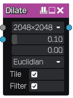

Dilate node
~~~~~~~~~~~~~

The **Dilate** node expands the white parts of its input mask. When a source input is connected,
it expands the source input following the mask.

Inputs
++++++

The **Dilate** node accepts:

* a mask grayscale input whose light parts will be dilated
* an optional color source input whose colors will be used in the output

Outputs
+++++++

The **Dilate** node generates a single color texture.

Parameters
++++++++++

The **Dilate** node accepts the following parameters:

* *resolution* is the resolution of the effect and only influences how details
  of the mask (and not the source if any) is captured. It is not recommended to
  set this value too high, and completely useless to set it higher than the generated
  textures resolution.
* *length* is the length of the dilate effect
* when *mode* is set to 0, the dilate effect generates a gradient around (based on the
  distance to) the white parts of the mask. When set to 1, the dilate effect just dilates
  the source (or the white color). Values in between mix both methods
* the *distance* function used for the Dilate operation (Euclidian, Manhattan or Chebyshev)
* a *tile* option to create a tileable result

Example images
++++++++++++++

