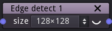
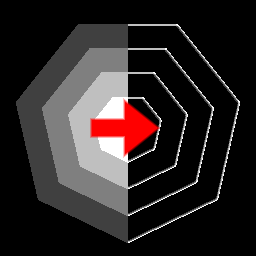

Edge detect node
~~~~~~~~~~~~~~~~

There are 3 different **Edge detect** nodes that apply an edge detect
filter to their input.

Inputs
++++++

The **Edge detect** node has a single input.

Outputs
+++++++

The **Edge detect** node outputs the result of the edge detect operation.

Parameters
++++++++++

The **Edge detect** node accepts the *grid size* as parameter.

Example images
++++++++++++++

