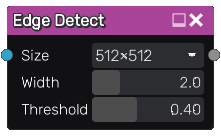

Edge Detect node
~~~~~~~~~~~~~~~~

There are 4 different **Edge Detect** nodes that apply an edge detect
filter to their input. Them main edge detect node has more parameters,
the 3 others are simplified (and faster) filters.

Inputs
++++++

The **Edge Detect** node has a single input.

Outputs
+++++++

The **Edge Detect** node outputs the result of the edge detect operation.

Parameters
++++++++++

The **Edge Detect** node accepts the following parameters:

* The *size* at which the input is sampled

* the *width* of the edge detection area for each pixel

* the value difference *threshold* used when comparing pixel colors

Example images
++++++++++++++

