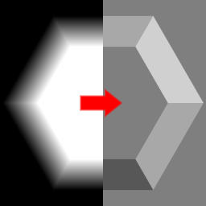

Emboss node
~~~~~~~~~~~

The **Emboss** node generates an image that simulates lighting on its input.

.. image:: images/node_emboss.png
	:align: center

Inputs
++++++

The **Emboss** node has a single greyscale input, interpreted as a heightmap.

Outputs
+++++++

The **Emboss** node outputs the result of the emboss operation.

Parameters
++++++++++

The **Emboss** node the following parameters:

* The *grid size* defines the size of the output image.

* the *angle* of the light source used for the emboss effect.

* the *strength* of the emboss effect.

Notes
+++++

This node outputs an image that has a fixed size.

Example images
++++++++++++++

