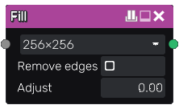

Fill node
~~~~~~~~~

The **Fill** node fills all areas surrounded by white pixels, and generates
a specific input for the **Fill to random grey**, the **Fill to random color** and
the **Fill to UV** nodes.

Inputs
++++++

The **Fill** node accepts:

* a mask greyscale input whose light parts surround areas that must be filled

Outputs
+++++++

The **Fill** node generates a single RGBA texture that contains the bounding
box of each filled area.

Parameters
++++++++++

The **Fill** node accepts the following parameters:

* *resolution* is the resolution of the effect and only influences how details
  of the mask (and not the source if any) is captured. It is advised to be careful
  with using high values here, as the computation time may become very long.
  Setting it higher than the input's resolution will not yield any benefit - only
  increase the computation time.
* *iterations* is the number of iterations of the fill algorithm. The optimal value
  for this parameter depends on the input image. Starting with 5 or 10, then increasing
  the value depending on the result is a good way of finding it.
