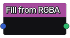

Fill from RGBA node
~~~~~~~~~~~~~~~~~~~

The **Fill from RGBA** node encodes Fill information from RGBA.

Red and green channels represent origin (top-left) of the bounding
box along X and Y axes, whereas blue and alpha channels
are the width and height of the bounding box.

Inputs
++++++

The **Fill from RGBA** node accepts a single RGBA input.

Outputs
+++++++

The **Fill from RGBA** node generates Fill information.

Parameters
++++++++++

The **Fill from RGBA** node does not have any parameter.
