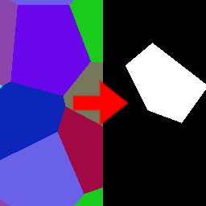

Fill Select node
~~~~~~~~~~~~~~~~

The **Fill Select** node uses the output of the **Fill** node and
generates a mask for a single user-selected area.

.. image:: images/node_filter_fill_select.png
	:align: center

Inputs
++++++

The **Fill Select** node accepts the output of a **Fill** node (or a
compatible output of another node) as input.

Outputs
+++++++

The **Fill Select** node generates a single grayscale image map that
shows a mask for the selected area.

Parameters
++++++++++

The **Fill Select** node accepts the coordinates of the location of the selected area.

Example images
++++++++++++++

