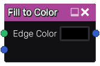

Fill to Color node
~~~~~~~~~~~~~~~~~~

The **Fill to Color** node uses the output of the **Fill** node and fills
all detected areas with a color taken from its other input.

Inputs
++++++

The **Fill to Color** node accepts the output of a **Fill** node (or a
compatible output of another node) as first input. The second input it
a color image the output colors are taken from.

Outputs
+++++++

The **Fill to Color** node generates a single color image map whose
color if taken from its other input, at the center of each area.

Parameters
++++++++++

The **Fill to color** node accepts the value of the color of edges in the
generated output as parameter.

Example images
++++++++++++++

