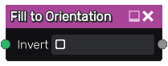

Fill to Orientation node
~~~~~~~~~~~~~~~~~~~~~~~~

The **Fill to Orientation** node uses the output of the **Fill** node and fills
all detected areas with a grayscale color that depends on their orientation.

Inputs
++++++

The **Fill to Orientation** node accepts the output of a **Fill** node (or a
compatible output of another node) as input.

Outputs
+++++++

The **Fill to Orientation** node generates a single grayscale image map whose value
is the orientation of the input (white: horizontal, black: vertical).

Parameters
++++++++++

The **Fill to Orientation** has a single parameter to invert its output.

Example images
++++++++++++++

