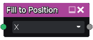
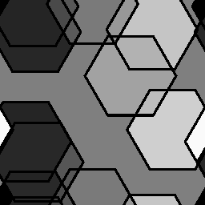

Fill to Position node
~~~~~~~~~~~~~~~~~~~~~

The **Fill to Position** node uses the output of the **Fill** node and fills
all detected areas with a grayscale color that depends on their position.

Inputs
++++++

The **Fill to Position** node accepts the output of a **Fill** node (or a
compatible output of another node) as input.

Outputs
+++++++

The **Fill to Position** node generates a single grayscale image map whose value
is the position (on the X or Y axis) of the center of the corresponding area.

Parameters
++++++++++

The **Fill to Position** accepts an *axis* parameter.

Example images
++++++++++++++

