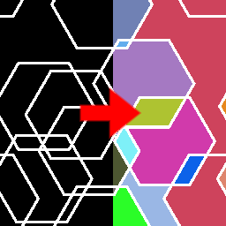

Fill to random color node
~~~~~~~~~~~~~~~~~~~~~~~~~

The **Fill to random color** node uses the output of the **Fill** node and fills
all detected areas with a random color.

Inputs
++++++

The **Fill to random color** node accepts the output of a **Fill** node (or a
compatible output of another node) as input.

Outputs
+++++++

The **Fill to random color** node generates a single color texture.

Parameters
++++++++++

The **Fill to random color** node accepts the value of the color of edges in the
generated output as parameter.

Example images
++++++++++++++

