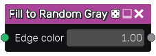

Fill to Random Gray node
~~~~~~~~~~~~~~~~~~~~~~~~

The **Fill to Random Gray** node uses the output of the **Fill** node and fills
all detected areas with a random shade of gray.

Inputs
++++++

The **Fill to Random Gray** node accepts the output of a **Fill** node (or a
compatible output of another node) as input.

Outputs
+++++++

The **Fill to Random Gray** node generates a single grayscale texture.

Parameters
++++++++++

The **Fill to Random Gray** node accepts the value of the color of edges in the
generated output as parameter.

Example images
++++++++++++++

.. image:: images/node_fill_to_random_grey_samples.png
	:align: center
