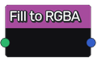

Fill to RGBA node
~~~~~~~~~~~~~~~~~

The **Fill to RGBA** node exposes Fill information as RGBA.

Red and green channels represent origin (top-left) of the bounding
box along X and Y axes, whereas blue and alpha channels
are the width and height of the bounding box.

Inputs
++++++

The **Fill to RGBA** node accepts the output of a **Fill** node (or a
compatible output of another node) as input.

Outputs
+++++++

The **Fill to RGBA** node generates a single RGBA image.

Parameters
++++++++++

The **Fill to RGBA** node does not have any parameter.
