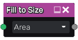

Fill to Size node
~~~~~~~~~~~~~~~~~

The **Fill to Size** node uses the output of the **Fill** node and fills
all detected areas with a grayscale color that depends on their size.

Inputs
++++++

The **Fill to Size** node accepts the output of a **Fill** node (or a
compatible output of another node) as input.

Outputs
+++++++

The **Fill to Size** node generates a single grayscale image map whose value
is the size (width, height or area).

Parameters
++++++++++

The **Fill to Size** accepts a parameter that defines how the size is
measured (width, height or area).

Example images
++++++++++++++

.. image:: images/node_fill_to_size_samples.png
	:align: center
