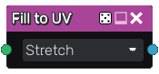

Fill to UV node
~~~~~~~~~~~~~~~

The **Fill to UV** node uses the output of the **Fill** node and fills
all detected areas with a UV map that covers each of them.

Inputs
++++++

The **Fill to UV** node accepts the output of a **Fill** node (or a
compatible output of another node) as input.

Outputs
+++++++

The **Fill to UV** node generates a single UV map, where the R and G channels
represent the X and Y coordinates of the pixel in the filled area, and the B
channel is a random value that depends on the area.

Parameters
++++++++++

The **Fill to UV** accepts a parameter that defines how the UV area is spread out on each UV island (strectch or square).

Example images
++++++++++++++

