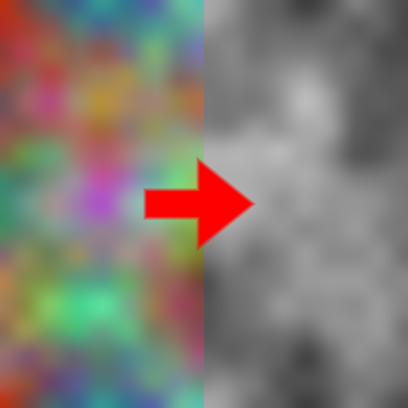

Grayscale node
~~~~~~~~~~~~~~

The **Grayscale** node converts a color image into grayscale.

Inputs
++++++

The **Grayscale** node requires a color input texture.

Outputs
+++++++

The **Grayscale** node provides a single grayscale texture.

Parameters
++++++++++

The **Grayscale** node accepts the *conversion algorithm* (*lightness*, *average*,
*luminosity*, *min* or *max*) as parameter.

Example images
++++++++++++++

