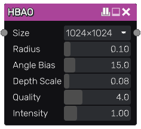
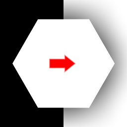

HBAO node
~~~~~~~~~~~~

The **HBAO** node generates a horizon based ambient occlusion texture from its input.

Inputs
++++++

The **HBAO** node accepts a single greyscale image as input, interpreted as a heightmap.

Outputs
+++++++

The **HBAO** node outputs the generated oclusion map.

Parameters
++++++++++

The **HBAO** node has the following parameters:

* the *size* of the ambient occlusion map

* the *radius* of affected range of point in UV size

* the *angle bias* - minimum angle on heightmap for AO to occur. Angle is calculated in UV space, where depth (grayscale input) is scaled by *depth scale* parameter

* the *depth scale* value controls cacluated normals & tangents by scaling range of values of grayscale input

* the *quality* controls number of steps per direction sampling

* the *intensity* of the generated ambient occlusion map

Notes
+++++

This node outputs an image that has a fixed size.

Example images
++++++++++++++

