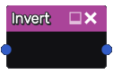
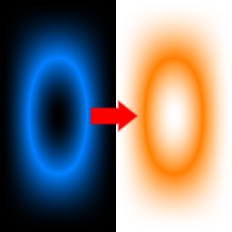

Invert node
~~~~~~~~~~~

The **Invert** node inverts the input image. The R, G and B channel are inverted, and the A channel
is left untouched.

Inputs
++++++

The **Invert** node requires an RGBA input texture.

Outputs
+++++++

The **Invert** node provides a single RGBA texture.

Parameters
++++++++++

The **Invert** node does not have any parameter.

Example images
++++++++++++++

