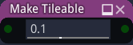

Make Tileable node
~~~~~~~~~~~~~~~~~~

The **Make Tileable** node replicates parts of its input to make its output tileable.
the input has to be a somewhat homogeneous pattern

Inputs
++++++

The **Make Tileable** node accepts an RGBA input.

Outputs
+++++++

The **Make Tileable** node generates a single RGBA texture that contains the result
of the operation.

Parameters
++++++++++

The **Make Tileable** node accepts a single parameter that defines the size of the transition
areas between the replicated parts of the input. 
