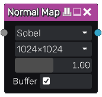
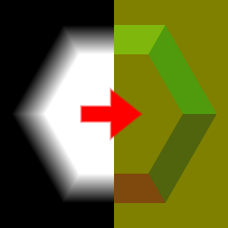

Normal Map node
~~~~~~~~~~~~~~~~

The **Normal Map** node generates a normal map from its input.

Inputs
++++++

The **Normal Map** node accepts a single greyscale image as input, interpreted as a heightmap.

Outputs
+++++++

The **Normal Map** node outputs the generated normal map.

Parameters
++++++++++

The **Normal Map** node has the following parameters:

* the *algorithm* used to generate the normal map (Sobel, Scharr, Simple or Cheap).
  When creating dynamic materials, Cheap is the recommended value

* the *size* of the normal map

* the *strength* of the normal map effect

* the *buffer* parameter decides if the input must be stored in a buffer before
  generating the normal map. Using a buffer is faster but can create artifacts
  in the normal map, and disabling this option will generate more accurate normal
  maps.
  For static materials, it is recommended to enable the buffer while editing a material and
  disable it before exporting.
  For dynamic materials, it is necessary to disable the buffer.

Notes
+++++

This node outputs a specific normal map format that is suited for Material nodes.
It is intentionnaly and obviously (yellowish instead of blueish) different from
standard OpenGL and DirectX formats. Connecting OpenGL or DirectX normal maps to
Material nodes will lead to incorrect maps when exporting.

If you need to export DirectX or OpenGL normal maps directly (either using the
Export node or from a 2D Preview panel), you can use the **Convert Normal Map**
node.

This node outputs an image that has a fixed size when the buffer option is set.

When using 3D Signed distance functions, it is recommended to use the normal map
generated by the 3D SDF render node.

Example images
++++++++++++++

