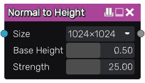

Normal to Height node
~~~~~~~~~~~~~~~~~~~~~

The **Normal to Height** node generates a height map from its input, that must be a normal
map in Material Maker's internal format.

Inputs
++++++

The **Normal to Height** node accepts a single color image as input, interpreted as a normal map.

Outputs
+++++++

The **Normal to Height** node outputs the generated height map.

Parameters
++++++++++

The **Normal to Height** node has the following parameters:

* the *Size* of the generated height map

* the *Base height* (the height of the center) of the generated height map

* the *Strength* of the effect, that affect the slopes of the generated height map

Example images
++++++++++++++

.. image:: images/node_normal_to_height_samples.png
	:align: center
