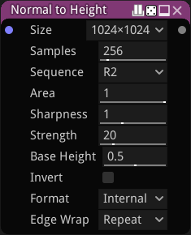

Normal to Height Improved node
~~~~~~~~~~~~~~~~~~~~~~~~~~~~~~

The **Normal to Height Improved** node generates a height map from its input.

Inputs
++++++

The **Normal to Height Improved** node accepts a single color image as input, interpreted as a normal map.

It can use either Material Maker's internal format, OpenGL format, or DirectX format.

Outputs
+++++++

The **Normal to Height Improved** node outputs the generated height map.

Parameters
++++++++++

The **Normal to Height** node has the following parameters:

* the *Size* of the generated height map

* the *Samples* used to calculate the height map

* the *Area* used for sampling, in terms of image size

* the *Sequence* used to generate sample positions. R2 and Fibonacci are quasi-random sequences.

* the *Sharpness* acts as an edge sharpness filter by altering the sample distribution.

* the *Base height* of the generated height map

* the *Strength* of the effect, that affect the slopes (the contrast) of the generated height map

* the *Invert* parameter will invert the result if checked

* the *Format* of the normal map input

* the *Edge Wrap* mode for samples outside the image bounds

Example images
++++++++++++++

