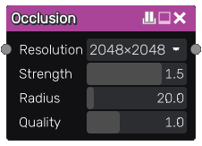

Occlusion node
~~~~~~~~~~~~~~

The **Occlusion** node generates an ambient occlusion texture from its input.

Inputs
++++++

The **Occlusion** node accepts a single grayscale image as input, interpreted as a heightmap.

Outputs
+++++++

The **Occlusion** node outputs the generated oclusion map.

Parameters
++++++++++

The **Occlusion** node has the following parameters:

* the *size* of the ambient occlusion map

* the *strength* of ambient occlusion (higher values generate darker shadows)

* the *range* of the ambient occlusion shadows

* the *quality* of the ambient occlusion effect

Notes
+++++

This node outputs an image that has a fixed size.

Example images
++++++++++++++

.. image:: images/node_occlusion_samples.png
	:align: center
