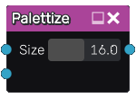
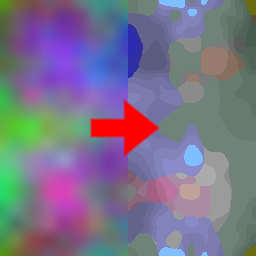

Palettize node
~~~~~~~~~~~~~~

The **Palettize** node maps its input to a palette (connected as an input)

Inputs
++++++

The **Palettize** node accepts an RGB input for the image to be palettized and
an RGB input for the palette.

Outputs
+++++++

The **Palettize** node generates a single RGB texture that contains the result
of the operation.

Parameters
++++++++++

The **Palettize** node accepts the size (width and height, which must be equal)
of the palette. The maximum supported size is 32x32.

Example images
++++++++++++++

