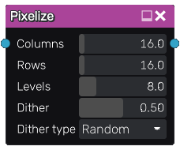

Pixelize node
~~~~~~~~~~~~~

The **Pixelize** node pixelizes its input

Inputs
++++++

The **Pixelize** node accepts an RGBA input.

Outputs
+++++++

The **Pixelize** node generates a single RGBA texture that contains the result
of the operation.

Parameters
++++++++++

The **Pixelize** node accepts the following parameters:

* *Columns* and *Rows* define the number of pixels in the result

* *Levels* is the number of different levels in the R, G, B channels, and consequently define the color palette of the result

* *Dither* is the amount of dithering in the result

* *Dither type* is the dither algorithm (Random, Bayer 2x2, Bayer 4x4, Bayer 8x8 or Bayer 16x16)

Example images
++++++++++++++

