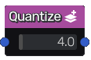
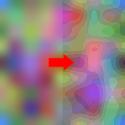

Quantize node
~~~~~~~~~~~~~

The **Quantize** node approximates the colors of the input image.

Inputs
++++++

The **Quantize** node accepts an RGBA input texture.

Outputs
+++++++

The **Quantize** node provides a single RGBA texture.

Parameters
++++++++++

The **Quantize** node accepts the *number of steps* as parameter.

Example images
++++++++++++++

