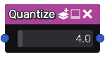

Quantize node
~~~~~~~~~~~~~

The **Quantize** node approximates the colors of the input image.

Inputs
++++++

The **Quantize** node accepts one or more RGBA input textures.

Outputs
+++++++

The **Quantize** node outputs RGBA textures.

Parameters
++++++++++

The **Quantize** node accepts the *number of steps* as parameter.

Example images
++++++++++++++

.. image:: images/node_quantize_samples.png
	:align: center
