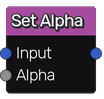

Set Alpha node
~~~~~~~~~~~~~~

The **Set Alpha** node sets alpha channel for the input image
using a grayscale input.

Inputs
++++++

The **Set Alpha** node accepts a single RGBA texture and a
grayscale input used for the alpha channel.

Outputs
+++++++

The **Set Alpha** node outputs a single RGBA texture.

Parameters
++++++++++

The **Set Alpha** node does not have any parameter.
