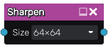

Sharpen node
~~~~~~~~~~~~

The **Sharpen** node applies a sharpen filter (that enhances the edges of the image) to its input.

Inputs
++++++

The **Sharpen** node has a single input.

Outputs
+++++++

The **Sharpen** node outputs the result of the sharpen operation.

Parameters
++++++++++

The **Sharpen** node accepts the *grid size* as parameter.

Example images
++++++++++++++

