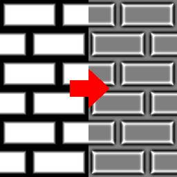

Smooth Curvature node
~~~~~~~~~~~~~~~~~~~~~

The **Smooth Curvature** node generates an curvature texture from its input.

.. image:: images/node_filter_smoothcurvature.png
	:align: center

Inputs
++++++

The **Smooth Curvature** node accepts a single greyscale image as input, interpreted as a heightmap.

Outputs
+++++++

The **Smooth Curvature** node outputs the generated curvature map where dark values are crevices,
light values are exposed shapes and grey values are neutral.

Parameters
++++++++++

The **Smooth Curvature** node has the following parameters:

* the *size* of the generated curvature map

* the *intensity* of the curvature calculation

Example images
++++++++++++++

