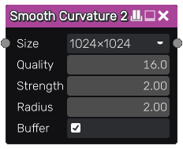

Smooth Curvature 2 node
~~~~~~~~~~~~~~~~~~~~~~~

The **Smooth Curvature 2** node generates an curvature texture from its input.

Inputs
++++++

The **Smooth Curvature 2** node accepts a single grayscale image as input, interpreted as a heightmap.

Outputs
+++++++

The **Smooth Curvature 2** node outputs the generated curvature map where dark values are crevices, light values are exposed shapes and grey values are neutral.

Parameters
++++++++++

The **Smooth Curvature 2** node has the following parameters:

* the *size* of the curvature map

* the *quality* of the curvature calculation

* the *strength* or contrast of the curvature map

* the *radius* taken into account for the curvature, adjust this to capture smaller or larger curvature details

* the *buffer* parameter decides if the input must be stored in a buffer before generating the curvature map

Example images
++++++++++++++

.. image:: images/node_smoothcurvature2_samples.png
	:align: center
