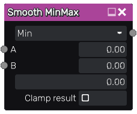

Smooth MinMax node
~~~~~~~~~~~~~~~~~~

The **Smooth MinMax** node performs a smooth minimum or smooth maximum math operation between its inputs.

Inputs
++++++

The **Smooth MinMax** node accepts two greyscale inputs. Those inputs are optional, and when
left unconnected, the corresponding parameter value is used.

Outputs
+++++++

The **Smooth MinMax** node generates a single greyscale texture that contains the result
of the operation.

Parameters
++++++++++

The **Smooth MinMax** node accepts the following parameters:

* the *operation* to be performed
* *default values* to be used in place of the inputs when left unconnected
* the *smoothness* to be applied during the minimum or maximum operation
* a boolean that specifies if the result must be clamped between 0 and 1

Example images
++++++++++++++

