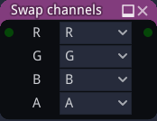

SwapChannels node
~~~~~~~~~~~~~~~~~

The **SwapChannels** node can be used to replace each channel (R, G, B and A) of
an with 0, 1 or a channel of its input (inverted or not).

Inputs
++++++

The **SwapChannels** node has a single RGBA input.

Outputs
+++++++

The **SwapChannels** node outputs an RGBA image whose channels are defined by its parameters.

Parameters
++++++++++

The **SwapChannels** node has a parameter for each channel that defines its value (0 or 1)
or source (a channel of the input image, inverted or not).
