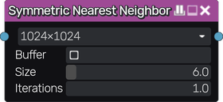

Symmetric Nearest Neighbor node
~~~~~~~~~~~~~~~~~~~~~~~~~~~~~~~

The **Symmetric Nearest Neighbor** node applies an edge-preserving smoothing filter to its input.

Inputs
++++++

The **Symmetric Nearest Neighbor** node has a single input.

Outputs
+++++++

The **Symmetric Nearest Neighbor** node outputs the result of the smoothing filter.

Parameters
++++++++++

The **Symmetric Nearest Neighbor** node accepts the following parameters:

* **Resolution** used to sample the input.

* Whether a **Buffer** is used to sample the input before the filter.

* **Size** of the filter.

* Number of times (**Iterations**) the filter is applied to the input.

Example images
++++++++++++++

