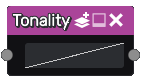

Tonality node
~~~~~~~~~~~~~

The **Tonality** node is variadic and applies a user-defined curve to grayscale images.

Inputs
++++++

The **Tonality** node accepts one or more grayscale input textures.

Outputs
+++++++

The **Tonality** node outputs grayscale textures.

Parameters
++++++++++

The **Tonality** node has a single parameter that defines the tonality curve to be applied to
the input image.

Notes
+++++

The input will be considered (and implicitly converted to) grayscale if it is a color texture.
