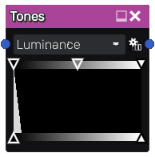

Tones node
~~~~~~~~~~

The **Tones** node provides an easy interface to adjust the tones of its input. It can be applied
homogeneously to the R, G and B channels, or separately on R, G, B and A.

The nodes shows a histogram of all channels of its input, and 3 cursors to modify the input
adjustment at the top, and 2 cursors to modify the output adjustment.

Inputs
++++++

The **Tones** node requires an RGBA input texture.

Outputs
+++++++

The **Tones** node provides a single RGBA texture.

Parameters
++++++++++

At the top of the node, a control can be used to select the active channel (Luminance, Red,
Green, Blue and Alpha).

The button can be used to adjust automatically the Tones to the node's input to obtain better
contrast.

The 3 cursors at the top of the histogram can be used to select the input colors that will be
remapped to black (value = 0 for single channel), mid-grey (value = 0.5) and white (value = 1).
Values between those defined by cursors are interpolated linearly, and all values are clamped
between 0 and 1.

The 2 bottom cursors define the output color for black (value = 0 for single channel) and
white (value = 1). 
