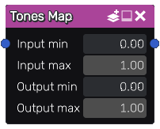

Tones Map node
~~~~~~~~~~~~~~

The **Tones Map** node is variadic and remaps images, given input and output tone intervals.
This node will not affect the alpha channel of the image. If necessary, the remap
operation is extrapolated linearly beyond the specified intervals.

Inputs
++++++

The **Tones Map** node accepts one or more RGBA input textures.

Outputs
+++++++

The **Tones Map** node outputs one or more RGBA textures.

Parameters
++++++++++

The **Tones Map** node accepts 4 parameters:

* the minimum and maximum input tones

* the minimum and maximum output tones