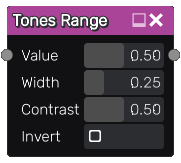

Tones Range node
~~~~~~~~~~~~~~~~

The **Tones Range** node selects a range of the input around a specified value.

Inputs
++++++

The **Tones Range** node requires a grayscale input texture.

Outputs
+++++++

The **Tones Range** node provides a single grayscale texture.

Parameters
++++++++++

The **Tones Range** node accepts 4 parameters:

* the *Value* around which the tones are selected

* the *Width* (in tones space) of the gradient around the value

* the *Contrast* of the gradient

* the *Invert* option that will invert the result if checked
