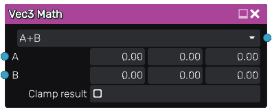

Vec3 Math node
~~~~~~~~~~~~~~

The **Vec3 Math** node performs various vector math operations between its inputs.

Inputs
++++++

The **Vec3 Math** node accepts two color inputs. Those inputs are optional, and when
left unconnected, the corresponding parameter value is used

Outputs
+++++++

The **Vec3 Math** node generates a single color texture that contains the result
of the vector math operation.

Parameters
++++++++++

The **Vec3 Math** node accepts the following parameters:

* the *operation* to be performed
* *default values* to be used in place of the inputs when left unconnected
* a boolean that specifies if the result must be clamped between 0 and 1
