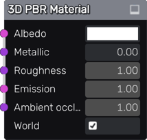
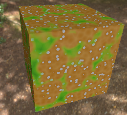

3D Material node
~~~~~~~~~~~~~~~~

The **3D Material** node describes a PBR material with Albedo, Metallic, Roughness,
Emission, and Ambient Occlusion generated by shaders whose input coordinates are the
3D position in world or local space.

Inputs
++++++

The **3D Material** node has inputs for all PBR channels.

Parameters
++++++++++

The **3D Material** has parameters for all PBR channels.

Exports
+++++++

The **3D Material** has exports for the Godot, Unity and Unreal game
engines. For Godot and Unity, ready to use materials are generated. For Unreal,
a shader is generated, to be used in a Custom node.

Example images
++++++++++++++

