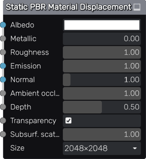

Static PBR Material Displacement node
~~~~~~~~~~~~~~~~~~~~~~~~~~~~~~~~~~~~~

The **Static PBR Material Displacement** node describes a PBR material with Albedo, Metallic, Roughness,
Emission, Depth and Normal Maps generated as static images. This node is identical to the **Static PBR Material**
node, except that it previews the depth texture using displacement in the 3D preview. Note you have to enable
tessellation in the *Model -> Configure* menu to take advantage of this.

Inputs
++++++

The **Static PBR Material Displacement** node has inputs for all PBR channels.

Parameters
++++++++++

The **Static PBR Material Displacement** has parameters for all PBR channels as well as
a size parameter that defines the size of all generated textures.

Exports
+++++++

The **Static PBR Material Displacement** has exports for Blender and the Godot, Unity and Unreal game
engines. For Godot and Unity, ready to use materials are generated. For Blender and
Unreal, texture files are generated and materials must be created manually.

Example images
++++++++++++++

