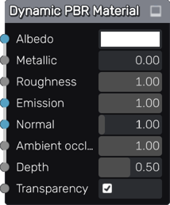

Dynamic PBR Material node
~~~~~~~~~~~~~~~~~~~~~~~~~

The **Dynamic PBR Material** node describes a PBR material with Albedo, Metallic, Roughness,
Emission, Depth and Normal Maps generated as static images.

Inputs
++++++

The **Dynamic PBR Material** node has inputs for all PBR channels.

Parameters
++++++++++

The **Dynamic PBR Material** has parameters for all PBR channels.

Exports
+++++++

The **Dynamic PBR Material** has exports for the Godot, Unity and Unreal game
engines. For Godot and Unity, ready to use materials are generated. For Unreal,
a shader is generated, to be used in a Custom node.

Example images
++++++++++++++

.. image:: images/node_material_dynamic_samples.gif
	:align: center
