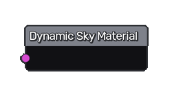
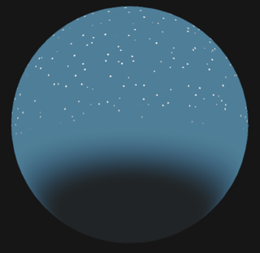

Dynamic Sky Material node
~~~~~~~~~~~~~~~~~~~~~~~~~

The **Dynamic Sky Material** node describes a sky material.

Inputs
++++++

The **Dynamic Sky Material** node has a single TEX3D input.

Parameters
++++++++++

The **Dynamic Sky Material** does not have any parameters.

Exports
+++++++

The **Dynamic Sky Material** has exports for the Godot game engine.

Example images
++++++++++++++

