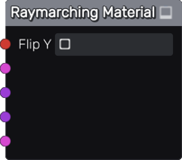
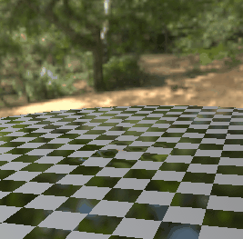

Raymarching Material node
~~~~~~~~~~~~~~~~~~~~~~~~~

The **Raymarching Material** node describes a material that raymarches
a surface defined using a Signed Distance Function, and applies albedo,
metallic, and roughness.

Inputs
++++++

The **Raymarching Material** node has inputs for the distance function and all PBR channels.

Parameters
++++++++++

The **Raymarching Material** has no parameter.

Exports
+++++++

The **Raymarching Material** has exports for the Godot, Unity and Unreal game
engines. For Godot and Unity, ready to use materials are generated. For Unreal,
a shader is generated, to be used in a Custom node.

Example images
++++++++++++++

