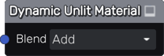
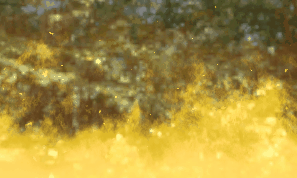

Unlit Material node
~~~~~~~~~~~~~~~~~~~

The **Unlit Material** node describes a simple unlit material.

Inputs
++++++

The **Unlit Material** node has inputs for the distance function and all PBR channels.

Parameters
++++++++++

The **Unlit Material** has a single partameter that defines the material blending mode.

Exports
+++++++

The **Unlit Material** has exports for the Godot, Unity and Unreal game
engines. For Godot and Unity, ready to use materials are generated. For Unreal,
a shader is generated, to be used in a Custom node.

Example images
++++++++++++++

