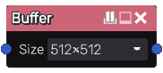

Buffer node
~~~~~~~~~~~

The **Buffer** and **Advanced Buffer** nodes sample their input into a texture of a given resolution and
outputs the result.

Buffers can be used either as inputs of complex nodes (to limit the combined
shader's complexity), or to create a cheap blur/pixelization effect (by using the
LOD output).

Note that many complex transforms that are provided in the nodes library
already include buffers where necessary. Buffers and nodes that use buffers
have a small icon in their title bar. Right clicking on that icon will show
a context menu that can be used to pause and resume the corresponding buffer(s).

Inputs
++++++

The **Buffer** node has an input that will be stored into its buffer image.

Outputs
+++++++

The **Buffer** node has a single output that provides the image

* the second output generates a given mipmap of the image

Parameters
++++++++++

The **Buffer** node has a single parameter, its *texture resolution*.

The **Advanced Buffer** node has 3 parameters:

* the *texture resolution*

* the *filter* property; if set, the buffer output will be filtered

* the *mipmap* property; if set, mipmaps will be generated for this buffer
