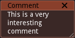

Comment node
~~~~~~~~~~~~

The Comment node has no effect on the material and can be used to document
it. Simply double-click on the contents to edit it.

Also see :doc:`Comment Line Node </node_miscellaneous_comment_line>`

By default, newly created comment nodes will be moved and resized to the selection.
This behavior can be disabled in the Preferences dialog, in the Graph tab.
