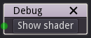
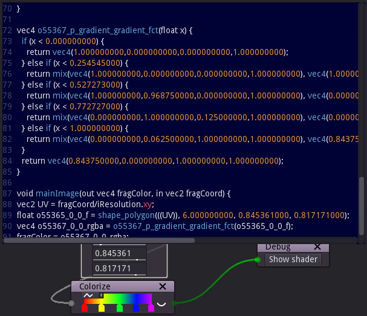

Debug node
~~~~~~~~~~~

The **Debug** node can be used to show the shader used to generate its input.

The **Show shader** button will open a pane that shows the whole shader. That code
can be copied and directly used in Shadertoy.

Inputs
++++++

The **Debug** node has an input whose shader can be shown.

Outputs
+++++++

The **Debug** node does not have any output.
