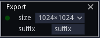

Export node
~~~~~~~~~~~

The **Export** node defines a texture that will be saved together with the
material textures when exporting the project.

Inputs
++++++

The **Export** node has an input that will be saved when exporting the project.

Outputs
+++++++

The **Export** node does not have any output.

Parameters
++++++++++

The **Export** node has two parameters:

* the resolution size of the exported file

* the suffix of the PNG file that will be created
