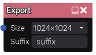

Export node
~~~~~~~~~~~

The **Export** node defines a texture that will be saved together with the
material textures when exporting the project. This node can also be triggered
manually via **Quick Export** under material exports without exporting a full
materaial.

Inputs
++++++

The **Export** node has an input that will be saved when exporting the project or triggered via **Quick Export**.

Outputs
+++++++

The **Export** node does not have any output.

Parameters
++++++++++

The **Export** node has three parameters:

* *Resolution* size of the exported file

* *Format* of the exported file (i.e. PNG, JPG, WebP or EXR)

* *Filename* of the created file. $node, $project, $idx and $resolution can be used.
